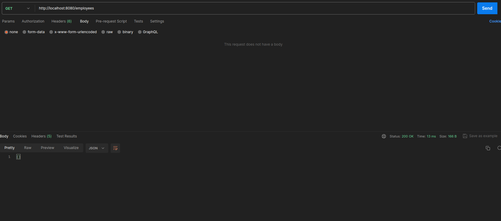
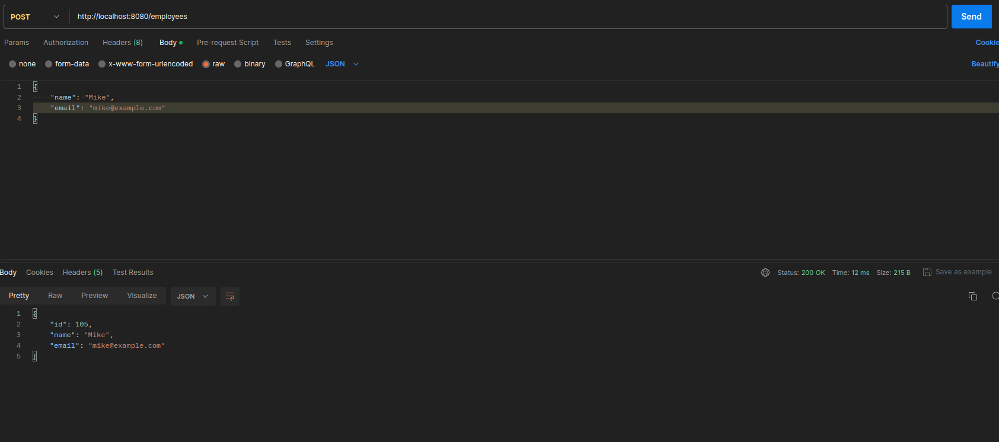
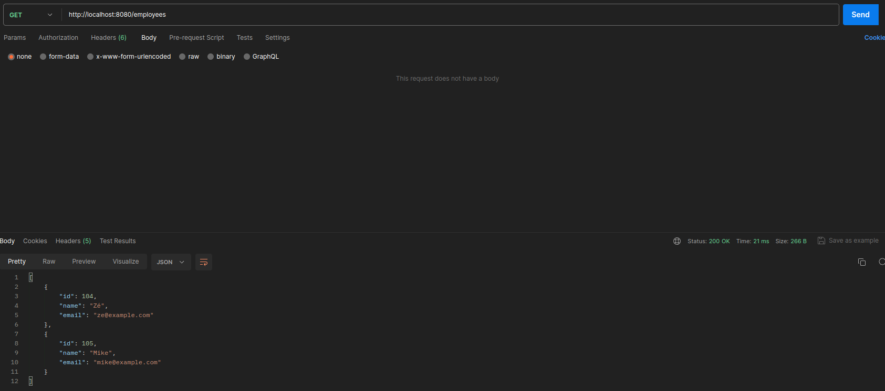
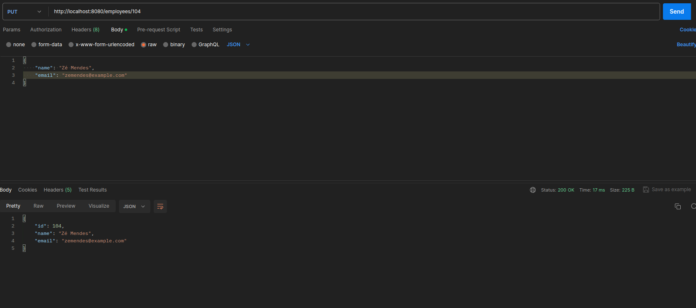
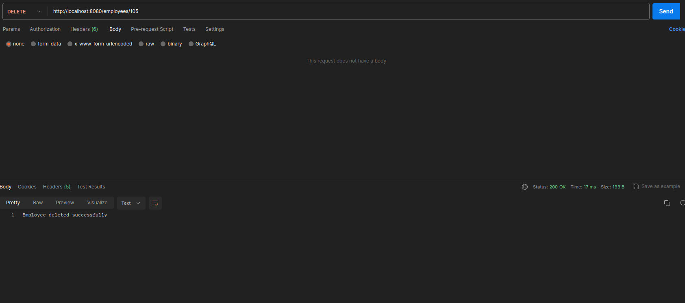
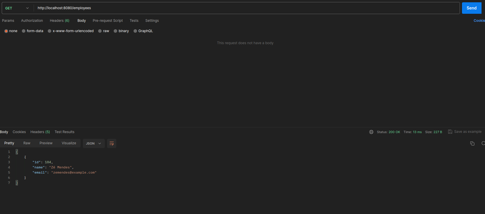
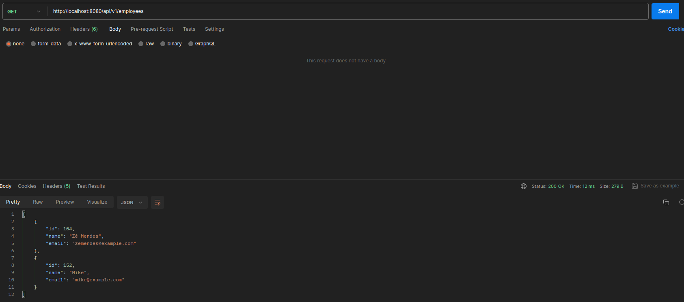
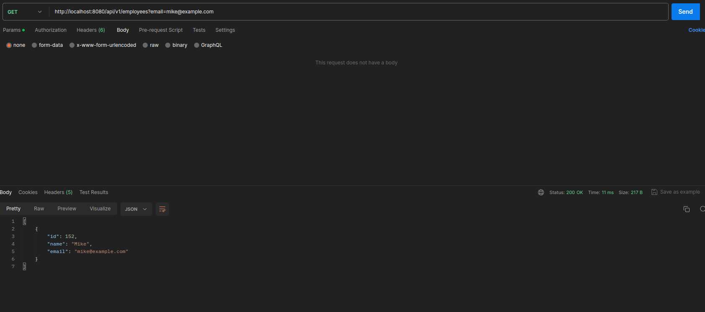

# IES Lab 3

## Accessing Databases in SpringBoot

The Jakarta Persistence API (JPA) defines a standard interface to manage data over relational databases. Spring Data uses and enhances the JPA. When you use Spring Data your Java code is independent
from the specific database implementation.

As a specification, the Jakarta Persistence API is concerned with persistence, which loosely means any mechanism by which Java objects outlive the application process that created them. The JPA specification lets you define which objects should be persisted, and how they are persisted in your Java applications.

By itself, JPA is not a tool or framework; rather, it defines a set of concepts that guide implementers. While JPA's object-relational mapping (ORM) model was originally based on Hibernate, it has since evolved. Likewise, while JPA was originally intended for use with relational databases, some JPA implementations have been extended for use with NoSQL datastores.

The implementation of DAO layers that provide CRUD functionality on JPA entities can be a repetitive, time-consuming task that we want to avoid in most cases.
Luckily, Spring Boot makes it easy to create CRUD applications through a layer of standard JPA-based CRUD repositories.

### Creating a SpringBoot project with Spring Data

Using the Spring Initializr create a new project with the following dependencies:

- Spring Web
- Thymeleaf
- Spring Data JPA
- H2 Database
- Validation

### Creating an entity

First we create a class, for example, **Person** , with the annotation **@Entity**, implying that it is a JPA entity and it is mapped to a table named **person** in the database.

We create private attributes for the class, this attributes will be the columns of the table in the database. The annotation **@Id** indicates that the attribute is the primary key of the table. The annotation **@GeneratedValue** indicates that the value of the attribute is generated automatically (with **strategy=GenerationType.AUTO**). Normally, we use both annotations together to indicate the primary key (usually a long) of the table.

The annotation **NotBlank** indicates that the attribute cannot be empty. We can put a message to show when the attribute is empty, for example, **@NotBlank(message = "Name is mandatory")**.

### Creating a repository

At this point, our sample web application does nothing.
Spring Data JPA allows us to implement JPA-based repositories (a fancy name for the DAO pattern implementation) with minimal fuss.

Spring Data JPA is a key component of Spring Boot’s spring-boot-starter-data-jpa that makes it easy to add CRUD functionality through a powerful layer of abstraction placed on top of a JPA implementation. This abstraction layer allows us to access the persistence layer without having to provide our own DAO implementations from scratch.

To provide our application with basic CRUD functionality, in this case, on Person objects, we need to extend the **CrudRepository**, giving
it CRUD functionality:
```
@Repository
public interface PersonRepository extends CrudRepository<Person, Long> {}
```

And that’s it! By extending the CrudRepository interface, Spring Data JPA will provide implementations for the repository’s CRUD methods for us.

### The Controller Layer

Thanks to the layer of abstraction that spring-boot-starter-data-jpa places on top of the underlying JPA implementation, we can easily add some CRUD functionality to our web application through a basic web tier.

In our case, a single controller class will suffice for handling GET and POST HTTP requests and then mapping them to calls to our PersonRepository implementation:

```
@Controller
public class PersonController {

    private final PersonRepository personRepository;

    public PersonController(PersonRepository personRepository) {
        this.personRepository = personRepository;
    }

    // GET and POST methods here
}
```

The controller class relies on some of Spring MVC’s key features. For a detailed guide on Spring MVC, check out our Spring MVC tutorial.

Let's create some GET/POST methods to see how this works in practice.
First we want to show the signup form:

```
@GetMapping("/signup")
public String showSignUpForm(Person person) {
    return "add-person";
}
```
> This GET method returns the template **add-person.html**.

Now we want to save the person in the database, for that we need a POST method:

```
@PostMapping("/addperson")
public String addPerson(@Valid Person person, BindingResult result, Model model) {
    if (result.hasErrors()) {
        return "add-person";
    }
    
    personRepository.save(person);
    return "redirect:/index";
}
```
> This method receives a **Person** object, validates it and saves it in the database. If the object is not valid, it redisplays the template **add-person.html**. If the object is valid, it saves it in the database and redirects to the template **index.html**.

It is also necessary to map the **/index** URL, in this case, it will show all the people in the database, thus we need to pass the list as an attribute:

```
@GetMapping("/index")
public String showPersonList(Model model) {
    model.addAttribute("people", personRepository.findAll());
    return "index";
}
```
> As we can see, the repository has a method **findAll()** that returns all the people in the database.

Finnaly we will map, **/edit/{id}**, **/update/{id}** and **/delete/{id}** URLs. The first one will show the template **update-person.html** with the person to edit, the second one will update the person in the database and the last one will delete the person from the database.

```
@GetMapping("/edit/{id}")
public String showUpdateForm(@PathVariable("id") long id, Model model) {
    Person person = personRepository.findById(id)
            .orElseThrow(() -> new IllegalArgumentException("Invalid person Id:" + id));

    model.addAttribute("person", person);
    return "update-person";
}

@PostMapping("/update/{id}")
public String updatePerson(@PathVariable("id") long id, @Valid Person person, BindingResult result, Model model) {
    if (result.hasErrors()) {
        person.setId(id);
        return "update-person";
    }

    personRepository.save(person);
    return "redirect:/index";
}

@GetMapping("/delete/{id}")
public String deletePerson(@PathVariable("id") long id, Model model) {
    Person person = personRepository.findById(id)
            .orElseThrow(() -> new IllegalArgumentException("Invalid person Id:" + id));
    personRepository.delete(person);
    return "redirect:/index";
}
```
> The **@PathVariable** annotation indicates that the method parameter should be bound to a URI template variable

> The **@Valid** annotation makes sure that the object passed in is valid according to the validation constraints we set in our Person class.

### The View Layer

At this point, we’ve implemented a functional controller class that performs CRUD operations on Person entities. Even so, there’s still a missing component in this schema: the view layer.

Under the src/main/resources/templates folder, we need to create the HTML templates required for displaying the signup form and the update form as well as rendering the list of persisted Person entities.

### Exercise c)

1. The “UserController” class gets an instance of “userRepository” through its constructor; how is this new repository instantiated?

- We use the annotation **@Autowired** to indicate that the constructor is autowired, this means that the Spring container will automatically inject an instance of the **UserRepository** class into the constructor when it creates the **UserController** class.
This feature enables you to inject the object dependency implicitly. It internally uses setter or constructor injection.

2. List the methods invoked in the “userRepository” object by the “UserController”. Where are these methods defined?

- The methods invoked in the **userRepository** object are **findAll()**, **findById()**, **save()** and **delete()**.
These methods are defined in the **CrudRepository** interface.

3. Where is the data being saved?

- The data is being saved in the **H2** database. By default, Spring Boot configures the application to connect to an in-memory store when using H2, so all data is lost when the application stops.

4. Where is the rule for the “not empty” email address defined?

- The rule for the “not empty” email address is defined in the **User** class with the annotation **@NotBlank** with the message **"Email is mandatory"**.

### Adding a new field to the entity

This can be done by adding a new attribute (e.g **phone number**) to the **Person** class, creating a getter, a setter and updating the contructor. Finnaly, we need to add the corresponding attribute to the templates (**index.html**, **add-person.html** and **update-person.html**).

## Multilayer applications: exposing data with REST interface

For this lab we will use an instance of MySQL server (versio 5.7) to store Employee information.

To host the database server let's use a Docker container. To do this, we will use the following command:

```
$ docker run --name mysql5 -e MYSQL_ROOT_PASSWORD=secret1 -e MYSQL_DATABASE=demo -e MYSQL_USER=demo -e MYSQL_PASSWORD=secret2 -p 33060:3306 -d mysql/mysql-server:5.7
```

The next step is to create a SpringBoot project with the following dependencies:
- Spring Web
- Spring Data JPA
- MySQL Driver
- DevTools
- Validation


### Configuring the application

In the **application.properties** file we need to add the following lines:

```
spring.datasource.url=jdbc:mysql://localhost:33060/demo
spring.datasource.username=demo
spring.datasource.password=secret2
spring.jpa.properties.hibernate.dialect=org.hibernate.dialect.MySQLDialect

spring.jpa.hibernate.ddl-auto=update
```
> The last line is used for database initialization. I’ve used the value “update” for this property to create the database tables automatically.

Here we have 2 new annotations in the Entity, **Table** and **Column**. The first one is used to specify the name of the table in the database. The second one is used to specify the name of the column in the database.

We also have a new annotation in the Controller, **RequestBody**. This annotation is used to bind the HTTP request body with a domain object in method parameter or return type.

#### Methods in the Controller

- @GetMapping("/employees") - This method returns all the employees in the database.
- @PostMapping("/employees") - This method saves an employee in the database.
- @GetMapping("/employees/{id}") - This method returns an employee with a specific id.
- @PutMapping("/employees/{id}") - This method updates an employee with a specific id.
- @DeleteMapping("/employees/{id}") - This method deletes an employee with a specific id.

#### Testing our application endpoints using Postman utility

- GET http://localhost:8080/employees - Before adding any employee:



- POST http://localhost:8080/employees - Adding an employee:



- GET http://localhost:8080/employees - After adding 2 employees:



- PUT http://localhost:8080/employees/{id} - Updating an employee:



- DELETE http://localhost:8080/employees/{id} - Deleting an employee:



- GET http://localhost:8080/employees/{id} - After deleting an employee and updating the other:



#### Method to search an employee by email (search by email)

Using **@RequestParam(required = false) String email** in the method parameter, we can search an employee by email. If the email is not specified, it returns all the employees in the database, that is why we use **required = false**.
If the email is specified we use the method **findByEmail()** in the repository to search the employee by email.
We can search by email using the following URL: http://localhost:8080/employees?email=green@mail.com

Example:

- Before using the search by email:



- Using it:




### Adding a intermediary Service Layer

The service layer is an intermediary between the controller layer and the repository layer. It is used to implement business logic and data manipulation. It is also used to reduce the code in the controller layer.

To implement, we call the methods in the repository layer in the service layer. Then we call the methods in the service layer in the controller layer, using
the **@Autowired** annotation in both like before.

The service layer implements methods like:

- findAll()
- findById()
- save()
- delete()
- update()
- ...

## How to Dockerize a Spring Boot Application

### Create a Dockerfile

First we need to run the command **./mvnw install** to create the **.jar** file.

Then we need to create a **Dockerfile** in the root directory of the project:

```
FROM eclipse-temurin:17-jdk-alpine
VOLUME /tmp
COPY target/*.jar app.jar
ENTRYPOINT ["java","-jar","/app.jar"]
```

Then we need to build and run the Docker image:

```
docker build -t ies_lab3_3 .
docker run --network=host -p 8080:8080 ies_lab3_3
```

> The **--network=host** option is used to connect the container to the host network. This is necessary to connect to the database.

### Create a docker-compose.yml file

We can also create a **docker compose** file to run the application and the database at the same time. Making it easier to run the application.

```
version: '3.8'

services:
  mysqldb:
    image: mysql:5.7
    restart: unless-stopped
    env_file: ./.env
    environment:
      - MYSQL_ROOT_PASSWORD=$MYSQLDB_ROOT_PASSWORD
      - MYSQL_DATABASE=$MYSQLDB_DATABASE
      - MYSQL_USER=$MYSQLDB_USER
      - MYSQL_PASSWORD=$MYSQLDB_PASSWORD
    ports:
      - $MYSQLDB_LOCAL_PORT:$MYSQLDB_DOCKER_PORT
    volumes:
      - db:/var/lib/mysql

  app:
    depends_on:
      - mysqldb
    build: .
    restart: on-failure
    env_file: ./.env
    ports:
      - $SPRING_LOCAL_PORT:$SPRING_DOCKER_PORT
    environment:
      SPRING_APPLICATION_JSON: '{
              "spring.datasource.url"  : "jdbc:mysql://mysqldb:$MYSQLDB_DOCKER_PORT/$MYSQLDB_DATABASE?useSSL=false",
              "spring.datasource.username" : "$MYSQLDB_USER",
              "spring.datasource.password" : "$MYSQLDB_PASSWORD",
              "spring.jpa.properties.hibernate.dialect" : "org.hibernate.dialect.MySQLDialect",
              "spring.jpa.hibernate.ddl-auto" : "update"
            }'
    volumes:
      - .m2:/root/.m2
    stdin_open: true
    tty: true


volumes:
    db:
```

> The **.env** file is used to store the environment variables.

> The **SPRING_APPLICATION_JSON** environment variable is used to configure the application, using the **application.properties** file.

As we can see, we have 2 services, **mysqldb** and **app**. Both need to define the environment variables, ports and volumes.

The environment variables are defined in the **.env** file:
    
```
MYSQLDB_USER=demo
MYSQLDB_ROOT_PASSWORD=secret1
MYSQLDB_DATABASE=demo
MYSQLDB_PASSWORD=secret2
MYSQLDB_LOCAL_PORT=33060
MYSQLDB_DOCKER_PORT=3306

SPRING_LOCAL_PORT=6868
SPRING_DOCKER_PORT=8080
```

Finally, we can run the application using the following command:

```
docker-compose up
```

To access the application we can use the port **6868** in this case.